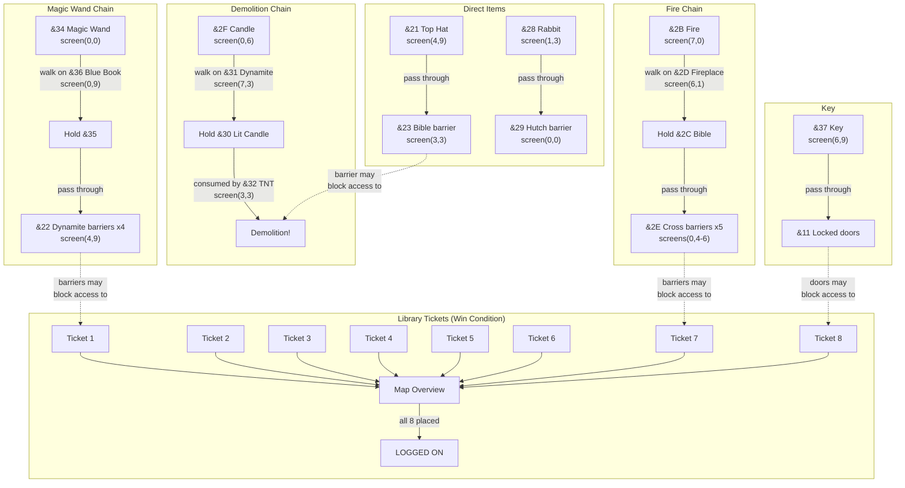

# Level 1 Object Map and Dependency Graph

## Object Reference


All indexed tiles rendered from Level 1 graphics with correct Mode 2 aspect
ratio (pixels are ~2:1 width:height).

## Pickupable Items

Items picked up with f0/f1 keys (type 0 or 1 in the tile type table).

| Tile | Sprite | Guess | Location | Purpose |
|------|--------|-------|----------|---------|
| &21 |  | **Top Hat** | screen(4,9) t(14,1) | Hold → pass through &23 barrier |
| &28 |  | **Rabbit** (or Key?) | screen(1,3) t(3,2) | Hold → pass through &29 barrier |
| &2B |  | **Fire** | screen(7,0) t(14,6) | Evolves via &2D chain |
| &2F |  | **Candle** (unlit) | screen(0,6) t(8,5) | Evolves via &31 chain |
| &34 |  | **Magic Wand** | screen(0,0) t(1,6) | Evolves via &36 chain |
| &37 |  | **Key** | screen(6,9) t(12,2) | Unlocks locked doors (&11) |

### Library Tickets (Terminal Codes)

| Tile | Sprite | Location |
|------|--------|----------|
| &38 |  | screen(1,2) t(5,1) |
| &39 |  | screen(2,5) t(14,6) |
| &3A |  | screen(1,9) t(15,3) |
| &3B |  | screen(7,2) t(11,2) |
| &3C |  | screen(6,0) t(6,6) |
| &3D |  | screen(7,7) t(9,4) |
| &3E |  | screen(1,7) t(8,3) |
| &3F |  | screen(6,9) t(5,2) |

## Barrier and Interaction Tiles

These tiles are NOT pickupable. They are normally **solid** (blocking) and
become **passable** when the frog carries the matching item, or they trigger
item transformations when walked on.

| Tile | Sprite | Guess | Type | Data | Effect | Count |
|------|--------|-------|------|------|--------|-------|
| &22 |  | Dynamite stick | 5 | &35 | Barrier → passable when holding &35 | 4 |
| &23 |  | Bible | 7 | &21 | Barrier → passable when holding &21 (top hat) | 1 |
| &29 |  | Rabbit hutch | 7 | &28 | Barrier → passable when holding &28 (rabbit) | 1 |
| &2A |  | Coloured blocks | 8 | &00 | Passable decoration (walk-through) | 12 |
| &2D |  | Fireplace | 9 | &2B | Auto-collect: fire &2B → &2C (bible) | 4 |
| &2E |  | Cross | 7 | &2C | Barrier → passable when holding &2C (bible) | 5 |
| &31 |  | Dynamite (lit) | 9 | &2F | Auto-collect: candle &2F → &30 (lit candle) | 2 |
| &32 |  | TNT bundle | 0B | &30 | Drop trigger: consumes &30 (lit candle) | 1 |
| &36 |  | Blue book | 9 | &34 | Auto-collect: wand &34 → &35 | 1 |

### Evolved Items (created by item transformation, not on the map)

| Tile | Sprite | Guess | Created by | Used for |
|------|--------|-------|------------|----------|
| &2C |  | Bible (red+cross) | Fire &2B + fireplace &2D | Pass through cross barriers &2E |
| &30 |  | Lit candle | Candle &2F + dynamite &31 | Consumed by TNT bundle &32 |
| &35 |  | Magic orb? | Wand &34 + blue book &36 | Pass through dynamite barriers &22 |

### Decoration

| Tile | Sprite | Notes |
|------|--------|-------|
| &24-&27 |  | "LIBRARY" sign (4 tiles) |

## Item Evolution Chains

Items transform through specific tile interactions. Carrying the right item
lets you **pass through** specific barrier tiles that are otherwise solid walls.

### Chain 1: Magic Wand → pass through Dynamite barriers
```
Pick up Magic Wand (&34) at screen(0,0)
    │
    ▼
Walk on Blue Book (&36, type 9) at screen(0,9)
    │  wand transforms → &35 (magic orb?)
    ▼
Holding &35 makes Dynamite tiles (&22) PASSABLE
    → 4 barrier tiles at screen(4,9) can now be walked through
```

### Chain 2: Fire → pass through Cross barriers
```
Pick up Fire (&2B) at screen(7,0)
    │
    ▼
Walk on Fireplace (&2D, type 9) at screen(6,1)
    │  fire transforms → &2C (bible)
    ▼
Holding &2C makes Cross tiles (&2E) PASSABLE
    → 5 barrier tiles at screens (0,4), (0,5), (0,6) can be walked through
```

### Chain 3: Candle → Demolition
```
Pick up Candle (&2F) at screen(0,6)
    │
    ▼
Walk on Dynamite (&31, type 9) at screen(7,3)
    │  candle transforms → &30 (lit candle)
    ▼
Walk on TNT Bundle (&32, type 0B) at screen(3,3)
    │  lit candle consumed! (clears slot, flash animation)
    ▼
Demolition effect triggered
```

### Chain 4: Top Hat → pass through Bible barrier
```
Pick up Top Hat (&21) at screen(4,9)
    │
    ▼
Holding &21 makes Bible tile (&23) PASSABLE
    → 1 barrier tile at screen(3,3) can be walked through
```

### Chain 5: Rabbit → pass through Hutch barrier
```
Pick up Rabbit (&28) at screen(1,3)
    │
    ▼
Holding &28 makes Hutch tile (&29) PASSABLE
    → 1 barrier tile at screen(0,0) can be walked through
```

### Chain 6: Key → Locked Doors
```
Pick up Key (&37) at screen(6,9)
    │
    ▼
Holding Key (type 1) allows passing through tile &11
    → All locked doors become passable
```

## Terminal Collection (Win Condition)

The 8 library tickets (&38-&3F, numbered 1-8) must all be collected and
placed on the map overview screen:

1. Explore the 8×10 screen map to find all 8 numbered tickets
2. Visit a map terminal (tile &04) — displays the overview map
3. Collected tickets (slot value >= &38) are automatically placed on
   the overview at row 6, with X position = tile_index - &31
4. Each placement increments `zp_terminal_ctr` and clears the slot
5. When `zp_terminal_ctr >= 8`, visiting tile &1F shows "LOGGED ON"

Since the frog only has 2 inventory slots, completing the game requires
multiple trips between terminals and the map overview — collecting 2
tickets at a time, placing them, then going back for more.

## Dependency DAG (Mermaid)



**Note:** Dotted lines show spatial dependencies — certain barriers must
be made passable to physically reach other items or tickets. The exact
routing depends on the player's path through the 8×10 screen grid.

## All 64 Tiles


8×8 grid showing every tile in the Level 1 tileset. Rows 0-3 are simple
tiles (&00-&1F): bricks, conveyors, ladders, decorations, hazards. Rows
4-7 are indexed tiles (&20-&3F): game objects, library sign, and the 8
numbered terminal tickets.
