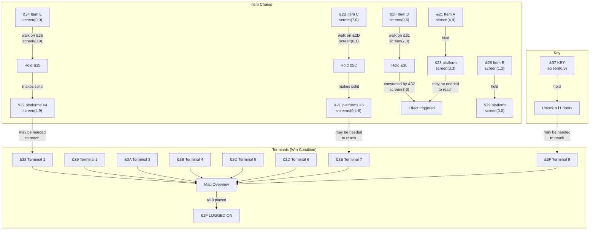

# Level 1 Object Map and Dependency Graph

## Pickupable Items

Items are tiles that can be picked up with f0/f1 keys (type 0 or 1 in the
tile type table). Each has a tile index that serves as its identity.

| Tile | Location           | Type | Purpose                         |
|------|--------------------|------|---------------------------------|
| &21  | screen(4,9) t(14,1)| 0    | Item A — makes tile &23 solid   |
| &28  | screen(1,3) t(3,2) | 0    | Item B — makes tile &29 solid   |
| &2B  | screen(7,0) t(14,6)| 0    | Item C — evolves via &2D chain  |
| &2F  | screen(0,6) t(8,5) | 0    | Item D — evolves via &31 chain  |
| &34  | screen(0,0) t(1,6) | 0    | Item E — evolves via &36 chain  |
| &37  | screen(6,9) t(12,2)| 1    | KEY — unlocks locked doors (&11)|
| &38  | screen(1,2) t(5,1) | 0    | Terminal 1 of 8                 |
| &39  | screen(2,5) t(14,6)| 0    | Terminal 2 of 8                 |
| &3A  | screen(1,9) t(15,3)| 0    | Terminal 3 of 8                 |
| &3B  | screen(7,2) t(11,2)| 0    | Terminal 4 of 8                 |
| &3C  | screen(6,0) t(6,6) | 0    | Terminal 5 of 8                 |
| &3D  | screen(7,7) t(9,4) | 0    | Terminal 6 of 8                 |
| &3E  | screen(1,7) t(8,3) | 0    | Terminal 7 of 8                 |
| &3F  | screen(6,9) t(5,2) | 0    | Terminal 8 of 8                 |

## Special Interaction Tiles

These tiles are NOT pickupable — they trigger effects when the frog walks on them.

| Tile | Type | Data | Effect                                    | Count |
|------|------|------|-------------------------------------------|-------|
| &22  | 5    | &35  | Solid platform when holding &35           | 4     |
| &23  | 7    | &21  | Solid platform when holding &21           | 1     |
| &29  | 7    | &28  | Solid platform when holding &28           | 1     |
| &2A  | 8    | &00  | Immovable solid block                     | 12    |
| &2D  | 9    | &2B  | Auto-collect: &2B → &2C                   | 4     |
| &2E  | 7    | &2C  | Solid platform when holding &2C           | 5     |
| &31  | 9    | &2F  | Auto-collect: &2F → &30                   | 2     |
| &32  | 0B   | &30  | Drop trigger: consumes &30                | 1     |
| &33  | 8    | &00  | Immovable solid block                     | (in &2A count) |
| &36  | 9    | &34  | Auto-collect: &34 → &35                   | 1     |

## Item Evolution Chains

Items transform through specific tile interactions:

### Chain 1: Item E → Platform Creator
```
Pick up &34 at screen(0,0)
    │
    ▼
Walk on &36 (type 9, data=&34) at screen(0,9)
    │  transforms &34 → &35
    ▼
Holding &35 makes tile &22 SOLID
    → 4 platform tiles at screen(4,9)
```

### Chain 2: Item C → Platform Creator
```
Pick up &2B at screen(7,0)
    │
    ▼
Walk on &2D (type 9, data=&2B) at screen(6,1)
    │  transforms &2B → &2C
    ▼
Holding &2C makes tile &2E SOLID
    → 5 platform tiles at screens (0,4), (0,5), (0,6)
```

### Chain 3: Item D → Consumed
```
Pick up &2F at screen(0,6)
    │
    ▼
Walk on &31 (type 9, data=&2F) at screen(7,3)
    │  transforms &2F → &30
    ▼
Walk on &32 (type 0B, data=&30) at screen(3,3)
    │  consumes &30 (clears slot, flash animation)
    ▼
Effect triggered (item consumed)
```

### Chain 4: Item A → Platform Creator
```
Pick up &21 at screen(4,9)
    │
    ▼
Holding &21 makes tile &23 SOLID
    → 1 platform tile at screen(3,3)
```

### Chain 5: Item B → Platform Creator
```
Pick up &28 at screen(1,3)
    │
    ▼
Holding &28 makes tile &29 SOLID
    → 1 platform tile at screen(0,0)
```

### Chain 6: KEY → Door Opener
```
Pick up &37 at screen(6,9)
    │
    ▼
Holding KEY (type 1) allows passing through tile &11
    → Locked doors become passable
```

## Terminal Collection (Win Condition)

The 8 terminal items (&38-&3F) must all be collected and placed on the
map overview screen. The sequence:

1. Explore the map to find all 8 terminals
2. Visit a map terminal (tile &04) — displays the overview
3. Collected terminals (slot value >= &38) are automatically placed on
   the overview at row 6, with X position = tile_index - &31
4. Each placement increments `zp_terminal_ctr` and clears the slot
5. When `zp_terminal_ctr >= 8`, visiting tile &1F shows "LOGGED ON"

## Dependency DAG (Mermaid)



**Note:** The dotted lines represent spatial dependencies — certain platforms
or unlocked doors may be required to physically reach other items or terminals.
The exact routing depends on the player's path through the 8×10 screen grid.
Full spatial dependency analysis would require pathfinding across the tile map.
