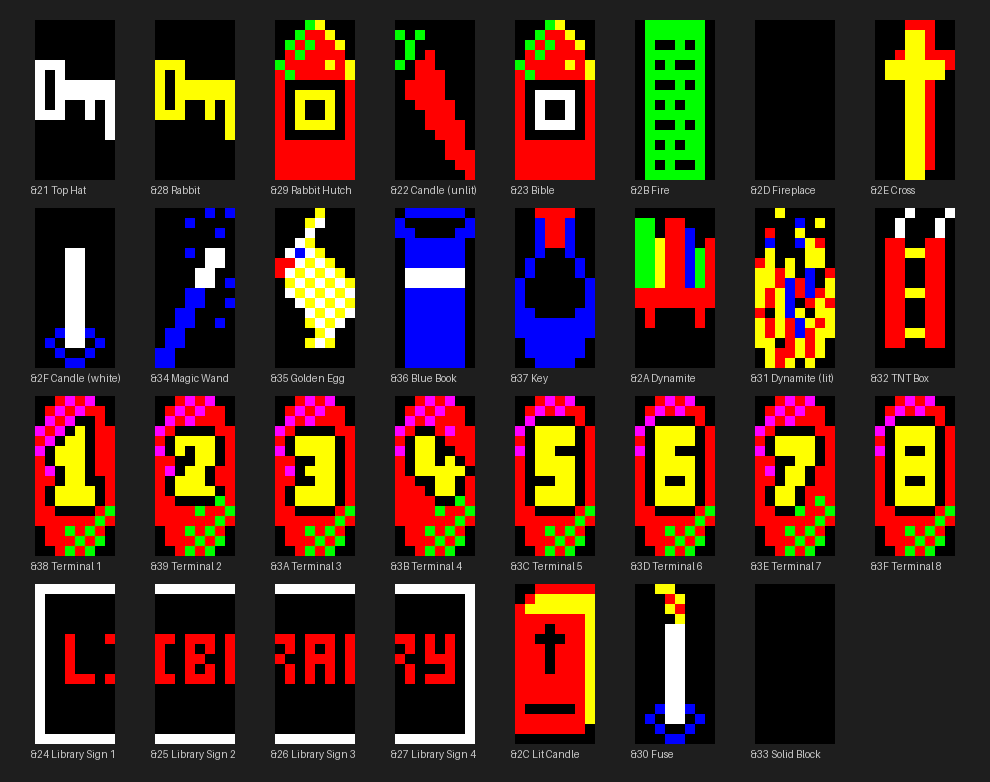
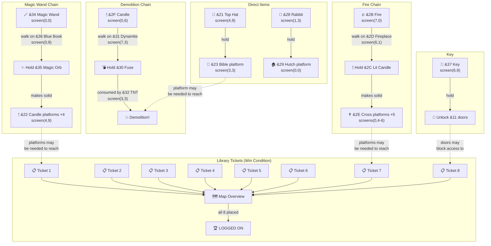
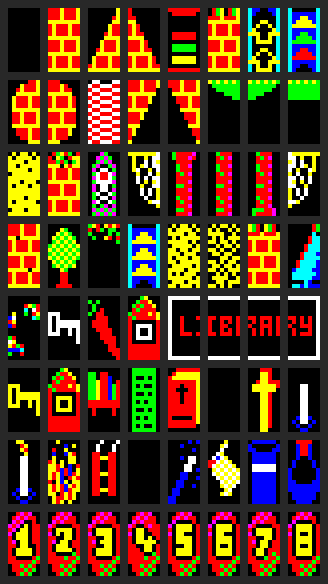

# Level 1 Object Map and Dependency Graph

## Object Reference



All indexed tiles (32-63) rendered from Level 1 graphics data. The game's
theme is clearly **stage magic** — top hats, rabbits, magic wands, and
fire are central to the puzzles. The 8 numbered "library tickets" are the
terminal codes needed to win.

## Pickupable Items

Items are tiles that can be picked up with f0/f1 keys (type 0 or 1 in the
tile type table). Each has a tile index that serves as its identity.

| Tile | Visual | Guess | Location | Purpose |
|------|--------|-------|----------|---------|
| &21 |  | **Top Hat** (white) | screen(4,9) t(14,1) | Hold to make &23 solid |
| &28 | | **Rabbit** (yellow) | screen(1,3) t(3,2) | Hold to make &29 solid |
| &2B | | **Fire** (green/red flames) | screen(7,0) t(14,6) | Evolves via &2D chain |
| &2F | | **Candle** (white, unlit) | screen(0,6) t(8,5) | Evolves via &31 chain |
| &34 | | **Magic Wand** (blue) | screen(0,0) t(1,6) | Evolves via &36 chain |
| &37 | | **Key** (blue) | screen(6,9) t(12,2) | Unlocks locked doors (&11) |
| &38-&3F | | **Library Tickets 1-8** (numbered) | scattered | Win condition tokens |

### Terminal Locations (Library Tickets)

| Tile | Label | Location |
|------|-------|----------|
| &38 | Ticket 1 | screen(1,2) t(5,1) |
| &39 | Ticket 2 | screen(2,5) t(14,6) |
| &3A | Ticket 3 | screen(1,9) t(15,3) |
| &3B | Ticket 4 | screen(7,2) t(11,2) |
| &3C | Ticket 5 | screen(6,0) t(6,6) |
| &3D | Ticket 6 | screen(7,7) t(9,4) |
| &3E | Ticket 7 | screen(1,7) t(8,3) |
| &3F | Ticket 8 | screen(6,9) t(5,2) |

## Special Interaction Tiles

These tiles are NOT pickupable — they trigger effects when the frog walks
on or near them.

| Tile | Visual Guess | Type | Data | Effect | Count |
|------|-------------|------|------|--------|-------|
| &22 | Candle (unlit, red) | 5 | &35 | Solid platform when holding &35 (magic orb) | 4 |
| &23 | Bible (red cover) | 7 | &21 | Solid platform when holding &21 (top hat) | 1 |
| &29 | Rabbit hutch (cage) | 7 | &28 | Solid platform when holding &28 (rabbit) | 1 |
| &2A | Dynamite sticks | 8 | &00 | Immovable solid block | 12 |
| &2D | Fireplace/hearth | 9 | &2B | Auto-collect: fire &2B → lit candle &2C | 4 |
| &2E | Cross/crucifix (yellow) | 7 | &2C | Solid platform when holding &2C (lit candle) | 5 |
| &31 | Dynamite (lit, red) | 9 | &2F | Auto-collect: candle &2F → fuse &30 | 2 |
| &32 | TNT box (green grid) | 0B | &30 | Drop trigger: consumes fuse &30 (demolition!) | 1 |
| &33 | Solid block | 8 | &00 | Immovable solid block | — |
| &36 | Blue book | 9 | &34 | Auto-collect: wand &34 → magic orb &35 | 1 |

### Evolved Items (not directly on map)

These tiles only appear in the player's inventory after an item evolution:

| Tile | Visual Guess | Created by | Used for |
|------|-------------|------------|----------|
| &2C | Lit candle (red+yellow) | Fire &2B + fireplace &2D | Makes cross tiles &2E solid |
| &30 | Fuse/wick (white) | Candle &2F + dynamite &31 | Consumed by TNT box &32 |
| &35 | Magic orb (golden) | Wand &34 + blue book &36 | Makes candle tiles &22 solid |

### Decoration Tiles

| Tile | Visual Guess | Notes |
|------|-------------|-------|
| &24-&27 | "LIBRARY" sign (4 tiles wide) | White text, placed at screens (5,1) and (6,1) |

## Item Evolution Chains

Items transform through specific tile interactions. The puzzles have a
**stage magic** theme throughout:

### Chain 1: Magic Wand → Magic Orb → Candle Platforms
```
Pick up Magic Wand (&34) at screen(0,0)
    │
    ▼
Walk on Blue Book (&36, type 9) at screen(0,9)
    │  wand transforms → Magic Orb (&35)
    ▼
Holding Magic Orb makes Candle tiles (&22) SOLID
    → 4 platform tiles at screen(4,9)
```
*The wand absorbs magical knowledge from the book, becoming an orb that
conjures candle-platforms into existence.*

### Chain 2: Fire → Lit Candle → Cross Platforms
```
Pick up Fire (&2B) at screen(7,0)
    │
    ▼
Walk on Fireplace (&2D, type 9) at screen(6,1)
    │  fire transforms → Lit Candle (&2C)
    ▼
Holding Lit Candle makes Cross tiles (&2E) SOLID
    → 5 platform tiles at screens (0,4), (0,5), (0,6)
```
*The fire lights a candle at the fireplace, and carrying the lit candle
illuminates the crosses in the church area, making them walkable.*

### Chain 3: Candle → Fuse → Demolition
```
Pick up Candle (&2F) at screen(0,6)
    │
    ▼
Walk on Dynamite (&31, type 9) at screen(7,3)
    │  candle transforms → Fuse (&30)
    ▼
Walk on TNT Box (&32, type 0B) at screen(3,3)
    │  fuse consumed! (clears slot, flash animation)
    ▼
Demolition effect triggered
```
*The candle lights the dynamite's fuse, which is then consumed by the TNT
box — presumably blowing something open.*

### Chain 4: Top Hat → Bible Platform
```
Pick up Top Hat (&21) at screen(4,9)
    │
    ▼
Holding Top Hat makes Bible tile (&23) SOLID
    → 1 platform tile at screen(3,3)
```
*The magician's top hat is the "key" that solidifies the bible — perhaps
a magic trick where the hat makes the book appear?*

### Chain 5: Rabbit → Hutch Platform
```
Pick up Rabbit (&28) at screen(1,3)
    │
    ▼
Holding Rabbit makes Hutch tile (&29) SOLID
    → 1 platform tile at screen(0,0)
```
*Putting the rabbit in its hutch creates a platform — the classic "rabbit
in a hat" trick, but with a hutch instead.*

### Chain 6: Key → Locked Doors
```
Pick up Key (&37) at screen(6,9)
    │
    ▼
Holding Key (type 1) allows passing through tile &11
    → All locked doors become passable
```

## Terminal Collection (Win Condition)

The 8 library tickets (&38-&3F, numbered 1-8) must all be collected and
placed on the map overview screen:

1. Explore the 8×10 screen map to find all 8 numbered tickets
2. Visit a map terminal (tile &04) — displays the overview map
3. Collected tickets (slot value >= &38) are automatically placed on
   the overview at row 6, with X position = tile_index - &31
4. Each placement increments `zp_terminal_ctr` and clears the slot
5. When `zp_terminal_ctr >= 8`, visiting tile &1F shows "LOGGED ON"

Since the frog only has 2 inventory slots, completing the game requires
multiple trips between terminals and the map overview — collecting 2
tickets at a time, placing them, then going back for more.

## Dependency DAG (Mermaid)



**Note:** Dotted lines show spatial dependencies — certain platforms or
unlocked doors may be required to physically reach other items or tickets.
The exact routing depends on the player's path through the 8×10 screen grid.

## All 64 Tiles



8×8 grid showing every tile in the Level 1 tileset. Rows 0-3 are simple
tiles (&00-&1F): bricks, conveyors, ladders, decorations, hazards. Rows
4-7 are indexed tiles (&20-&3F): game objects, library sign, and the 8
numbered terminal tickets.
