# Level 1 Object Map and Dependency Graph

Object identifications confirmed by the original artist (Matt Godbolt, 2026).

## Complete Tile Index (&20-&3F)

All indexed tiles in order, rendered with correct Mode 2 aspect ratio:

| Tile | Sprite | Identity | Type | Notes |
|------|--------|----------|------|-------|
| &20 | *(n/a)* | *(type table data)* | — | Not a visible tile; pixel data encodes type lookup |
| &21 |  | **White Key** | 0 | Pickupable. Hold → pass through White Door (&23) |
| &22 | 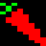 | *(barrier)* | 5 | Passable when holding Rabbit (&35) |
| &23 | 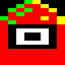 | **White Door** | 7 | Barrier → passable when holding White Key (&21) |
| &24 |  | **Carrot** | 0 | Pickupable decoration |
| &25 |  | *(decoration)* | 0 | |
| &26 |  | *(decoration)* | 0 | |
| &27 |  | *(decoration)* | 0 | |
| &28 |  | **Yellow Key** | 0 | Pickupable. Hold → pass through Yellow Door (&29) |
| &29 | 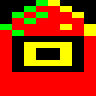 | **Yellow Door** | 7 | Barrier → passable when holding Yellow Key (&28) |
| &2A | 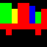 | **Bookshelf** | 8 | Passable decoration (walk-through) |
| &2B |  | **Library Ticket** | 0 | Pickupable. Evolves via &2D chain |
| &2C |  | **Bible** | 7 | Barrier → passable when holding evolved item &2C |
| &2D |  | **Blank / Teleporter?** | 9 | Auto-collect: ticket &2B → &2C (bible) |
| &2E |  | **Cross** | 7 | Barrier → passable when holding &2C (bible) |
| &2F | 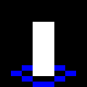 | **Unlit Candle** | 0 | Pickupable. Evolves via &31 chain |
| &30 | 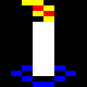 | **Lit Candle** | — | Evolved from unlit candle. Consumed by TNT (&32) |
| &31 | 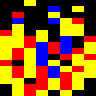 | **Fire** | 9 | Auto-collect: candle &2F → &30 (lit candle) |
| &32 | 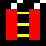 | **TNT** | 0B | Drop trigger: consumes lit candle &30 |
| &33 |  | *(solid block)* | 8 | Passable decoration |
| &34 | 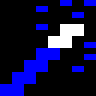 | **Magic Wand** | 0 | Pickupable. Evolves via &36 chain |
| &35 | 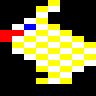 | **Rabbit** | — | Evolved from wand + top hat. Hold → pass through &22 |
| &36 | 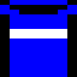 | **Top Hat** | 9 | Auto-collect: wand &34 → &35 (rabbit!) |
| &37 | 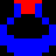 | **Ring** | 1 | Pickupable. Unlocks locked doors (&11) |
| &38 | 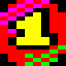 | **Terminal 1** | 0 | Library ticket (collect all 8 to win) |
| &39 | 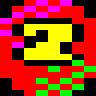 | **Terminal 2** | 0 | |
| &3A | 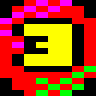 | **Terminal 3** | 0 | |
| &3B | 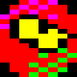 | **Terminal 4** | 0 | |
| &3C |  | **Terminal 5** | 0 | |
| &3D | 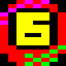 | **Terminal 6** | 0 | |
| &3E | 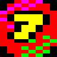 | **Terminal 7** | 0 | |
| &3F | 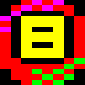 | **Terminal 8** | 0 | |

## Pickupable Items

| Tile | Sprite | Identity | Location | Purpose |
|------|--------|----------|----------|---------|
| &21 |  | **White Key** | screen(4,9) t(14,1) | Hold → pass through White Door &23 |
| &24 |  | **Carrot** | screen(5,1), screen(6,1) | Decoration / collectible |
| &28 |  | **Yellow Key** | screen(1,3) t(3,2) | Hold → pass through Yellow Door &29 |
| &2B |  | **Library Ticket** | screen(7,0) t(14,6) | Evolves via &2D chain |
| &2F |  | **Unlit Candle** | screen(0,6) t(8,5) | Evolves via Fire (&31) chain |
| &34 |  | **Magic Wand** | screen(0,0) t(1,6) | Evolves via Top Hat (&36) chain |
| &37 |  | **Ring** | screen(6,9) t(12,2) | Unlocks locked doors (&11) |

### Terminal Codes (collect all 8 to win)

| Tile | Sprite | Location |
|------|--------|----------|
| &38 |  | screen(1,2) t(5,1) |
| &39 |  | screen(2,5) t(14,6) |
| &3A |  | screen(1,9) t(15,3) |
| &3B |  | screen(7,2) t(11,2) |
| &3C |  | screen(6,0) t(6,6) |
| &3D |  | screen(7,7) t(9,4) |
| &3E |  | screen(1,7) t(8,3) |
| &3F |  | screen(6,9) t(5,2) |

## Barrier and Interaction Tiles

These tiles are **solid by default** and become **passable** when the frog
carries the matching item (types 5, 7), or they trigger item transformations
when walked on (type 9), or consume items (type 0B).

| Tile | Sprite | Identity | Type | Data | Effect | Count |
|------|--------|----------|------|------|--------|-------|
| &22 |  | *(barrier)* | 5 | &35 | Passable when holding Rabbit (&35) | 4 |
| &23 |  | White Door | 7 | &21 | Passable when holding White Key (&21) | 1 |
| &29 |  | Yellow Door | 7 | &28 | Passable when holding Yellow Key (&28) | 1 |
| &2A |  | Bookshelf | 8 | &00 | Passable decoration (walk-through) | 12 |
| &2D |  | Blank/Teleporter? | 9 | &2B | Auto-collect: ticket &2B → &2C | 4 |
| &2E |  | Cross | 7 | &2C | Passable when holding Bible (&2C) | 5 |
| &31 |  | Fire | 9 | &2F | Auto-collect: candle &2F → lit candle &30 | 2 |
| &32 |  | TNT | 0B | &30 | Drop trigger: consumes lit candle &30 | 1 |
| &36 |  | Top Hat | 9 | &34 | Auto-collect: wand &34 → rabbit &35 | 1 |

## Item Evolution Chains

### Chain 1: Magic Trick — Wand + Top Hat → Rabbit
```
Pick up Magic Wand (&34) at screen(0,0)
    │
    ▼
Walk on Top Hat (&36, type 9) at screen(0,9)
    │  wand goes INTO the hat → Rabbit (&35) comes out!
    ▼
Holding Rabbit makes barrier tiles (&22) PASSABLE
    → 4 barrier tiles at screen(4,9) can be walked through
```
*The classic magic trick: put the wand in the hat, pull out a rabbit.*

### Chain 2: Library Ticket → Bible → Cross barriers
```
Pick up Library Ticket (&2B) at screen(7,0)
    │
    ▼
Walk on Blank/Teleporter (&2D, type 9) at screen(6,1)
    │  ticket transforms → Bible (&2C)
    ▼
Holding Bible makes Cross tiles (&2E) PASSABLE
    → 5 barrier tiles at screens (0,4), (0,5), (0,6)
```
*The library ticket becomes a bible, which lets you pass through crosses.*

### Chain 3: Candle + Fire → Lit Candle → TNT
```
Pick up Unlit Candle (&2F) at screen(0,6)
    │
    ▼
Walk on Fire (&31, type 9) at screen(7,3)
    │  candle is lit → Lit Candle (&30)
    ▼
Walk on TNT (&32, type 0B) at screen(3,3)
    │  lit candle consumed! (flash animation)
    ▼
Demolition effect triggered
```
*Light the candle in the fire, then use it to ignite the TNT.*

### Chain 4: White Key → White Door
```
Pick up White Key (&21) at screen(4,9)
    │
    ▼
Holding White Key makes White Door (&23) PASSABLE
    → 1 barrier at screen(3,3) can be walked through
```

### Chain 5: Yellow Key → Yellow Door
```
Pick up Yellow Key (&28) at screen(1,3)
    │
    ▼
Holding Yellow Key makes Yellow Door (&29) PASSABLE
    → 1 barrier at screen(0,0) can be walked through
```

### Chain 6: Ring → Locked Doors
```
Pick up Ring (&37) at screen(6,9)
    │
    ▼
Holding Ring (type 1) allows passing through tile &11
    → All locked doors become passable
```

## Terminal Collection (Win Condition)

The 8 terminal codes (&38-&3F, numbered 1-8) must all be collected and
placed on the map overview screen:

1. Explore the 8×10 screen map to find all 8 numbered terminals
2. Visit a map terminal (tile &04) — displays the overview map
3. Collected terminals (slot value >= &38) are automatically placed on
   the overview at row 6, with X position = tile_index - &31
4. Each placement increments `zp_terminal_ctr` and clears the slot
5. When `zp_terminal_ctr >= 8`, visiting tile &1F shows "LOGGED ON"

Since the frog only has 2 inventory slots, completing the game requires
multiple trips between terminals and the map overview.

## Dependency DAG (Mermaid)

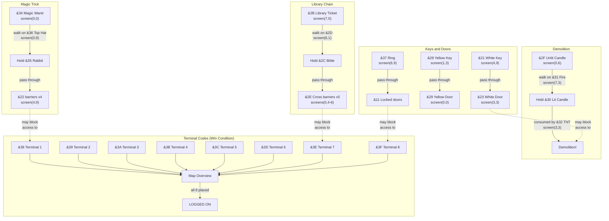

## All 64 Tiles


8×8 grid showing every tile in the Level 1 tileset. Rows 0-3 are simple
tiles (&00-&1F): bricks, conveyors, ladders, decorations, hazards. Rows
4-7 are indexed tiles (&20-&3F): game objects and terminal codes.
