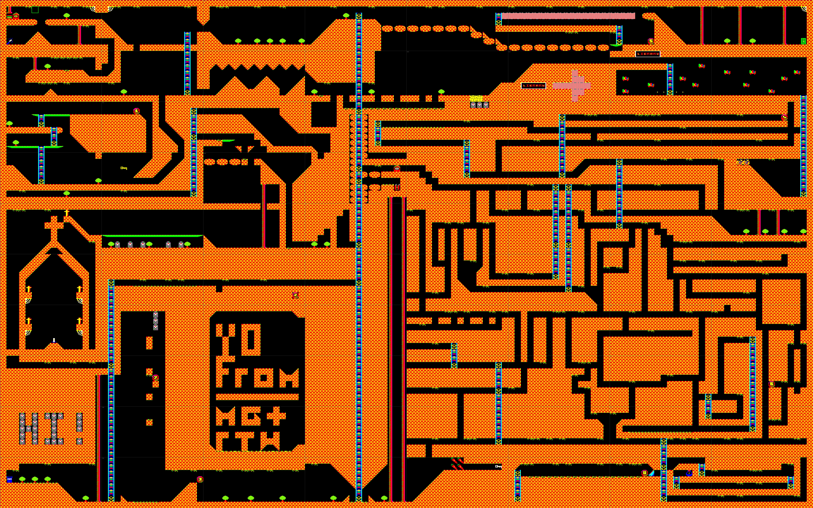
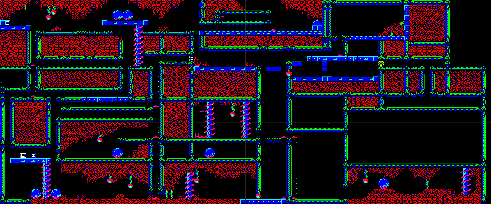

# FROGMAN

A BBC Master platformer written by Matt Godbolt and Richard Talbot-Watkins in February 1993.

This repository contains a fully annotated, instruction-level disassembly of the game, suitable for reassembly with [BeebASM](https://github.com/stardot/beebasm).

## The Game

FROGMAN is a flip-screen platformer for the BBC Master. You control a frog navigating levels filled with platforms, ladders, hazards, and collectible items. The game features two levels, palette cycling animation, music, and a lives system.

Controls: **Z** (right), **X** (down), **:** (climb), **/** (short hop), **f0** (use item slot 0), **f1** (use item slot 1), **SPACE** (start), **ESCAPE** (die/restart). There is also a hidden debug key: **M** toggles sprite display.

The original game files are heavily encrypted on disk using a 55-stage XOR encryption chain with VIA timer-based PRNG seeds, making static analysis intentionally impossible. This disassembly was produced by booting the game in an emulator and dumping decrypted memory at runtime.

## Level Maps

Full world maps rendered from the game data (click to view full size):

**Level 1** (8×10 screens):



**Level 2** (6×5 screens):



Yellow dots mark item/special tile positions. Green rectangle marks the frog's start position.

## Building

```bash
make
```

Requires [BeebASM](https://github.com/stardot/beebasm). Produces `frogman_rebuilt.ssd` which can be booted in any BBC Master emulator.

## Verification

```bash
./verify.sh
```

Confirms byte-exact match of assembled output against the original decrypted binaries, and builds the disc image.

## Repository Structure

```
frogman.ssd               Original disk image (1993)

frogman.asm                Main BeebASM build file
constants.asm              Shared constants (OS entry points, hardware registers)
zero_page.asm              Named zero page variable definitions
engine.asm                 Game engine: rendering, sprites, movement, sound
tables.asm                 Lookup tables: tile source addressing, palette, sound
music.asm                  Music data: three tunes + sound state block
game.asm                   Game code: main loop, IRQ, collision, keyboard, levels
boot.bas                   BASIC boot loader
bootcmd.txt                !Boot file for disc

extracted/                 Raw files from disk image
extracted/decrypted/       Decrypted memory dumps from emulator
data/                      Reference binaries for verification

render_map.py              Level map renderer (generates PNG world maps)
verify.sh                  Byte-exact verification script
save_dumps.py              Memory dump collection tooling
Makefile                   Build system
DIARY.md                   Reverse engineering diary
```

## Technical Details

### Memory Map

| Address | Size | Contents |
|---|---|---|
| `&0000-&0028` | 41 bytes | Zero page: game state, pointers, counters |
| `&0060-&0091` | 50 bytes | Zero page: sprite state arrays (4 sprites) |
| `&0600-&065D` | 94 bytes | IRQ handler area (swapped in during gameplay) |
| `&0700-&073F` | 64 bytes | Tile source low-byte LUT |
| `&0740-&077F` | 64 bytes | Tile source high-byte LUT |
| `&0780-&07FF` | 128 bytes | Palette/fade tables (also SN76489 frequency data) |
| `&0800-&087F` | 128 bytes | Sound envelope curve table |
| `&0880-&0C79` | 1018 bytes | **Game engine** — rendering, sprites, movement, sound |
| `&0C7A-&0EFF` | 646 bytes | Music data (3 tunes) + sound state block |
| `&0F00-&36FF` | 10240 bytes | Level tile map (80 screens, 128 bytes each) |
| `&3700-&47FF` | 4352 bytes | Tile graphics (pixel data) |
| `&4800-&57FF` | 4096 bytes | **Game code** — main loop, IRQ, items, movement |
| `&5800+` | | Screen display memory (custom CRTC base) |
| `&7800-&7FFF` | 2048 bytes | Status bar graphics |

### Screen Layout

The game uses a custom CRTC configuration: display base `&5800`, `&200`-byte character row stride, 128×160 pixel display (64 characters × 20 rows). This is a non-standard Mode 2 layout. The tile renderer composites graphics via an AND mask table on the 6502 stack page (`&0100`).

### Map Format

Each level map is 10240 bytes (80 screens arranged in an 8×10 grid). Each screen contains 16×8 tiles (128 bytes). The map pointer formula from `setup_map_render`:

```
map_ptr = &0F00 + screen_y * &400 + screen_x * &80
```

### Sound

The SN76489 sound chip is accessed via the **System VIA** at `&FE40`/`&FE41`. Port B bit 3 controls the write-enable line. The engine has `set_tone` (frequency) and `set_volume` (attenuation with inverted caller convention: 0=silent, &0F=loud).

### Encryption

The original Loader uses a ~55-stage decryption chain. Each stage XORs data with fixed keys, 256-byte blocks, VIA timer values (timing-dependent), and byte indices. The VIA timer dependency means XOR keys vary with exact CPU cycle timing — even single-stepping in a debugger produces wrong results.

## Reverse Engineering Process

1. **Boot in emulator** — jsbeeb with BBC Master model
2. **Wait for decryption** — select level, let the 55-stage loader complete
3. **Dump memory** — read all memory regions from the running game via jsbeeb MCP
4. **Disassemble** — radare2 with 6502 architecture
5. **Annotate** — every instruction documented in BeebASM syntax with named labels
6. **Verify** — rebuild and compare against original (byte-exact match achieved)

See [DIARY.md](DIARY.md) for the full reverse engineering diary.

## Credits

- **Original game**: Matt Godbolt & Richard Talbot-Watkins (1993)
- **Reverse engineering & annotation**: Matt Godbolt & Claude (2026)
